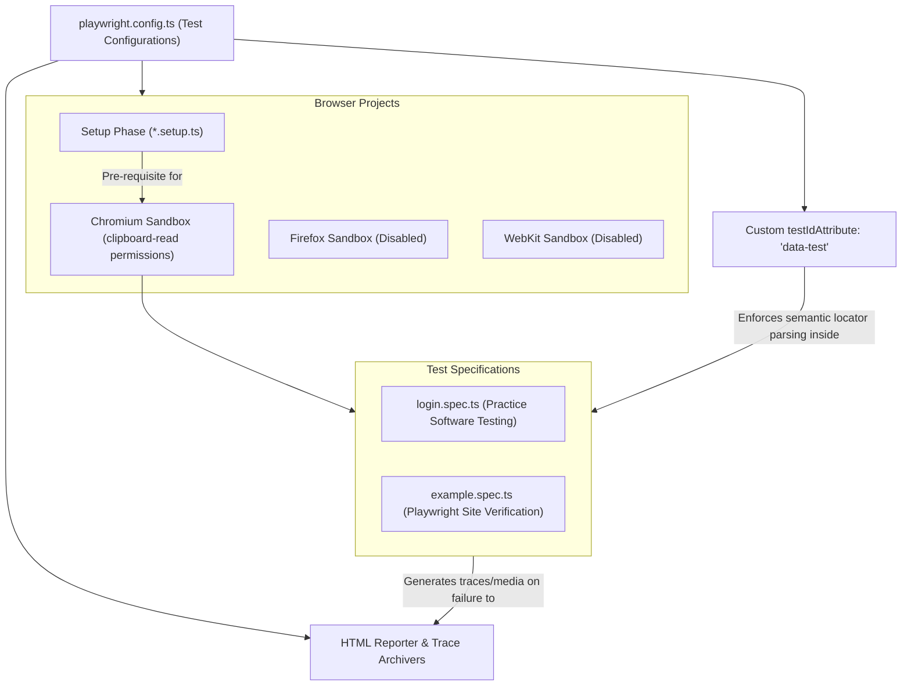

# Learning Playwright (LinkedIn Learning Curriculum)

A production-ready, hands-on automation repository built to practice end-to-end (E2E) testing with **Playwright** and **TypeScript**, aligned with the **LinkedIn Learning** course curriculum. This project demonstrates strict locator setups, multi-browser configurations, secure session tracking, tracing, and automated fail-state capture workflows on real-world test sites (like `practicesoftwaretesting.com`).

---

## 🛠️ Technology Stack & Dependencies


---

## 🚀 Key Learning Features & Architectures

*   **🎯 Semantic Locator Strategy**: Leverages custom HTML attributes (`data-test` hooks) using Playwright's `testIdAttribute` settings, isolating locators from standard CSS layout modifications.
*   **🏗️ Custom Project Setup Dependencies**: Integrates multi-stage run setups (`testMatch: /.*\.setup\.ts/`) to ensure pre-requisite configurations complete before launching desktop chromium threads.
*   **⚡ Fully Parallelized Execution**: Configures Playwright's parallel runner suite (`fullyParallel: true`) to split test execution across CPU cores, maximizing E2E throughput.
*   **🛡️ Robust Error Tracing & Media Recovery**: Automatically archives full session traces, videos, and layout screenshots upon test failures (`screenshot: 'only-on-failure'`, `video: 'retain-on-failure'`, `trace: 'on'`).
*   **🧑‍💻 Secure DevContainer Environments**: Ships with preconfigured `.devcontainer` and `.vscode` settings, ensuring instant environment bootstrap with correct editor testing extensions.
*   **🌲 Detailed Branch-by-Branch Curriculum Mapping**: Mirrors course lectures exactly through specific code branches (`CHAPTER#_MOVIE#`) with beginning (`b`) and end (`e`) states.

---

## 📐 Playwright Configuration Architecture

This diagram maps out how the central configuration feeds browser environments, custom locator standards, and trace files:



---

## 📂 Repository File Directory

```
Learning-Playwright-from-LinkedIn-Learning/
├── .devcontainer/                 # Virtual Docker environment configurations
│   └── devcontainer.json          # Launches a pre-configured Playwright containers workspace
├── .vscode/                       # Workspace specific editor properties
│   └── extensions.json            # Recommends the official Playwright runner extension
├── tests/                         # E2E Test Suite files
│   ├── example.spec.ts            # Basic target routing verification spec
│   └── login.spec.ts              # Authentication & nav verify spec on practice software testing
├── playwright.config.ts           # Central configuration detailing viewports, retries, and traces
├── RESOURCES.md                   # Complete resources & links mapping out Butch Mayhew's lessons
├── CONTRIBUTING.md                # Development standard guidelines for codebase contributions
├── LICENSE                        # Apache 2.0 license file
├── NOTICE                         # Copyright distribution notices
└── package.json                   # Project scripts and dependencies declarations
```

---

## 📝 Key Source Code Showcases

### 1. Centralized Playwright Runner Configuration ([playwright.config.ts](file:///d:/for%20CV/My%20learnings/Learning-Playwright-from-LinkedIn-Learning/playwright.config.ts))
Highlights the custom semantic locator mappings and failure capturing parameters:
```typescript
import { defineConfig, devices } from "@playwright/test";

export default defineConfig({
  timeout: 30 * 1000,
  testDir: "./tests",
  fullyParallel: true,
  reporter: "html",
  use: {
    baseURL: "https://practicesoftwaretesting.com",
    testIdAttribute: "data-test", // Binds locators to data-test="..." attributes
    trace: "on",
    video: "retain-on-failure",
    screenshot: "only-on-failure",
    headless: true,
  },
  projects: [
    {
      name: "setup",
      testMatch: /.*\.setup\.ts/,
    },
    {
      name: "chromium",
      dependencies: ["setup"],
      use: { ...devices["Desktop Chrome"], permissions: ["clipboard-read"] },
    },
  ],
});
```

### 2. Practice Software Testing Spec ([login.spec.ts](file:///d:/for%20CV/My%20learnings/Learning-Playwright-from-LinkedIn-Learning/tests/login.spec.ts))
Validates login routines using exact semantic `data-test` selectors:
```typescript
import { test, expect } from "@playwright/test";

test("Verify Account Authentication Flow", async ({ page }) => {
  await page.goto("https://practicesoftwaretesting.com/");
  
  // Custom testId locator queries
  await page.locator('[data-test="nav-sign-in"]').click();
  await page.locator('[data-test="email"]').fill("customer2@practicesoftwaretesting.com");
  await page.locator('[data-test="password"]').fill("welcome01");
  await page.locator('[data-test="login-submit"]').click();
  
  await expect(page.locator('[data-test="nav-menu"]')).toContainText("Jack Howe");
  await expect(page.locator('[data-test="page-title"]')).toContainText("My account");
});
```

---

## 🚀 Setup & Execution Guide

### Prerequisites
Make sure the following are installed:
*   **Node.js** (LTS version recommended)
*   **Composer / Git** client interfaces

### Installation & Run Steps
1.  **Clone the Repository**:
    ```bash
    git clone https://github.com/Imtiaz-Ali17314/Learning-Playwright-from-LinkedIn-Learning
    cd Learning-Playwright-from-LinkedIn-Learning
    ```
2.  **Install Node Dependencies**:
    ```bash
    npm install
    ```
3.  **Install Target Browser Binaries**:
    ```bash
    npx playwright install chromium
    ```
4.  **Run All Test Suites**:
    ```bash
    npm test
    ```
5.  **Run with Interactive UI Dashboard**:
    ```bash
    npm run test:ui
    ```
6.  **Open HTML Execution Report**:
    ```bash
    npx playwright show-report
    ```

---

## 🌲 Switching Exercise Chapters
To view codes at a specific lesson sequence:
1.  List all remote branches:
    ```bash
    git branch -a
    ```
2.  Switch to your target chapter/video branch (e.g., Chapter 2, Video 3):
    ```bash
    git checkout 02_03
    ```
